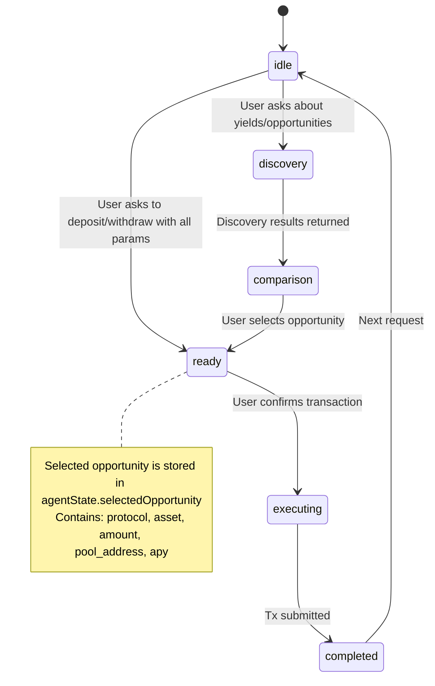

# YieldMind Tool Efficiency Skill

Teaches the YieldMind DeFi agent to select, batch, cache, chain, and retry tool calls with maximum efficiency. Covers all 15 agent tools, deterministic vs LLM-driven flows, and error recovery patterns.

## When to Use This Skill

Use when working on `src/lib/agent-tools.ts`, `src/lib/agent-planner.ts`, `src/app/api/agent/route.ts`, or any file that controls how the YieldMind agent invokes tools. Also use when debugging slow agent responses, redundant API calls, or tool selection bugs.

---

## 1. TOOL SELECTION MATRIX

### Intent → Tool Mapping (Strict Priority Order)

| User Intent | Primary Tool(s) | Fallback | NEVER Use |
|---|---|---|---|
| "show my portfolio" / "what do I have" | `get_portfolio_summary` | — | `check_balance` + `get_positions` separately |
| "how much USDC do I have" | `check_balance` | — | `get_portfolio_summary` (overkill for single token) |
| "best yields" / "where to invest" | `discover_opportunities` (no asset filter) | — | Multiple calls with different asset filters |
| "deposit 1000 USDC into Aave" | `check_balance` + `discover_opportunities` → `prepare_deposit` | — | Skip balance check |
| "withdraw from Aave" | `get_positions` → `prepare_withdraw` | — | `check_balance` first |
| "is Aave safe?" | `get_protocol_info` | — | `analyze_risk` without positions |
| "risk of my portfolio" | `get_portfolio_summary` → `analyze_risk` | — | `get_positions` alone |
| "gas cost" | `get_gas_estimate` | — | `get_market_overview` then parse gas |
| "ETH price" | `get_token_price` | — | `get_market_overview` then parse price |
| "market snapshot" | `get_market_overview` | — | `get_token_price` + `get_gas_estimate` separately |

### Anti-Patterns (NEVER Do These)

1. **Redundant portfolio fetch**: Calling both `get_portfolio_summary` AND `get_positions` + `check_balance`. The summary already includes all of this.
2. **Multi-asset discovery loops**: Calling `discover_opportunities` once per asset (USDC, then ETH, then WBTC). One call with no filter returns everything.
3. **Unnecessary approval checks**: Calling `check_approval` before `prepare_deposit` — the deposit prep handles approval internally.
4. **Quote before prepare**: Calling `get_quote` then `prepare_deposit` for the same parameters. Prep includes quote-level info.

---

## 2. PARALLEL vs SEQUENTIAL EXECUTION

### Parallel-Safe Tools (No Dependencies, Batch Together)

These tools have NO data dependencies on each other. Always execute in parallel when multiple are needed in the same round:

```
Round 1 (Parallel):
├── check_balance          ← needs: wallet_address, token
├── discover_opportunities ← needs: chain, optional filters
├── get_market_overview    ← needs: nothing (or optional asset)
└── get_gas_estimate       ← needs: chain, action
```

### Sequential-Required Tools (Dependent on Prior Results)

These tools NEED output from a prior step:

```
Round 1 (Parallel):
├── check_balance          → result: { balance, usd_value }
└── discover_opportunities → result: [{ protocol, apy, pool_address, ... }]

Round 2 (Sequential, depends on Round 1):
├── prepare_deposit        → needs: amount from user + pool_address from discovery
│                            AND validates balance >= amount
└── prepare_withdraw       → needs: position_id from get_positions

Round 3 (Sequential, depends on Round 2 + User Confirm):
├── build_transaction_deposit   → needs: user_confirmation = true
└── build_transaction_withdraw  → needs: user_confirmation = true
```

### Dependency Graph

```mermaid
graph TD
    A[User Request] --> B{Parse Intent}
    B -->|deposit| C1[check_balance || discover_opportunities]
    B -->|withdraw| C2[get_positions]
    B -->|discover| C3[discover_opportunities]
    B -->|portfolio| C4[get_portfolio_summary]
    B -->|risk| C5[get_portfolio_summary -> analyze_risk]
    
    C1 --> D1[prepare_deposit]
    C2 --> D2[prepare_withdraw]
    
    D1 --> E1[build_transaction_deposit *user confirms*]
    D2 --> E2[build_transaction_withdraw *user confirms*]
```

---

## 3. CACHING STRATEGY

### Cache TTL Reference (from `src/lib/cache.ts`)

| Data Type | TTL | Cache Key Pattern |
|---|---|---|
| Token Price | 60s | `price:{token}` |
| Gas Estimate | 30s | Gas key in session cache |
| Opportunities | 60s | `opp:{chain}:{asset}:{protocol}:...` |
| LI.FI Opportunities | 60s | Separate LI.FI cache |
| Protocol Info | 300s (5min) | `protocol:{name}` |
| Token Balance | 15s | Session cache per token |
| Positions | 30s | Session cache `positions` |
| Quote | 15s | Quote-specific key |
| Market Overview | 120s (2min) | Session cache `market` |
| Portfolio Summary | 30s | Session cache `portfolio` |

### Cache Hit Rules

**ALWAYS respect cache hits for:**
- `get_token_price` — prices change slowly, 60s TTL is appropriate
- `get_protocol_info` — protocol data is static, 5min TTL
- `get_market_overview` — 2min TTL covers most use cases
- `discover_opportunities` — 60s TTL prevents API spam to DeFi Llama

**MAY bypass cache for:**
- `check_balance` — if user just confirmed a transaction (balance changed)
- `get_positions` — if user just completed a deposit/withdraw (positions changed)
- `prepare_deposit` / `prepare_withdraw` — never cached (always fresh)

**Invalidate cache after state-changing actions:**
After `build_transaction_deposit` or `build_transaction_withdraw` succeeds:
- Invalidate: `balance_{asset}`, `positions`, `portfolio`
- Keep: `opportunities`, `protocol_info`, `token_price` (unchanged)

### Session Cache Invalidation

Session cache (in `agent-planner.ts`) auto-expires after **120 seconds**. The keys are:

| Key | Set By | Typical Hits/Session |
|---|---|---|
| `disc_{protocol}_{asset}` | `discover_opportunities` | 2-3 (users re-ask) |
| `positions` | `get_positions` | 2-3 |
| `balance_{TOKEN}` | `check_balance` | 3-5 |
| `portfolio` | `get_portfolio_summary` | 2-3 |
| `market` | `get_market_overview` | 1-2 |
| `gas` | `get_gas_estimate` | 1-2 |

---

## 4. ERROR HANDLING & RETRY CLASSIFICATION

### Non-Retryable Errors (Stop Immediately, Don't Retry)

These errors indicate invalid inputs — retrying won't help:

| Error Pattern | Meaning | Agent Action |
|---|---|---|
| `not deployed` | Contract doesn't exist on chain | Report error, suggest alternative protocol |
| `not found` | Pool/address doesn't exist | Re-run discovery to find valid address |
| `Unsupported` | Action not supported | Suggest supported alternative |
| `Invalid` | Bad parameter format | Re-prompt user for correct input |
| `Failed to encode` | ABI encoding error | Check contract address validity |
| `Missing ZAI_API_KEY` | Config error | Return config error message |

### Retryable Errors (Retry Once with Backoff)

| Error Pattern | Retry Strategy | Max Attempts |
|---|---|---|
| HTTP 429 (Rate Limit) | Wait 500ms * 2^attempt | 2 retries (in `createChatCompletion`) |
| HTTP 500 / 503 | Wait 500ms * 2^attempt | 2 retries |
| Network timeout (>30s) | Abort, return timeout error | 0 retries (fail fast) |
| DeFi Llama fetch failure | Try LI.FI fallback, then fail | 1 fallback attempt |
| RPC call failure | Return 0/default value | 0 retries (per-token graceful degrade) |

### Error Response Format for LLM

When a tool fails, return structured error to the LLM so it can adapt:

```json
{
  "error": "Human-readable reason",
  "nonRetryable": true/false,
  "hint": "What the LLM should do next"
}
```

Examples:
- `{ "error": "Pool 0x1234... not found on Base", "nonRetryable": true, "hint": "Re-discover opportunities for valid pool addresses" }`
- `{ "error": "DeFi Llama timed out", "nonRetryable": false, "hint": "You may retry once for network errors." }`

---

## 5. TOOL RESULT TRUNCATION RULES

LLM context is expensive. Truncate results BEFORE sending to the LLM:

### Per-Tool Truncation (implemented in `truncateToolResult()`)

| Tool | Truncation Rule | Max Results |
|---|---|---|
| `discover_opportunities` | Keep top 7, show `_truncated: "+N more"` | 7 rows |
| `get_positions` | Strip internal fields, keep display fields | All positions |
| `get_portfolio_summary` | Strip token metadata, keep symbol/balance/value | All tokens + positions |
| Everything else | Hard cap at 4000 chars | 4000 chars |

### Fields to ALWAYS Include in Truncated Results

For discovery results, always keep: `protocol`, `asset`, `apy`, `tvl`, `risk_level`, `pool_address`, `recommended`

For positions, always keep: `protocol`, `asset`, `deposited`, `current_value`, `entry_apy`, `position_id`, `chain`

### Fields to ALWAYS Drop

- Internal IDs, raw ABI data, full transaction calldata
- Duplicate/derivable fields (e.g., `usd_value` when `balance` + `price` exists)
- Verbose protocol descriptions (use `get_protocol_info` only when explicitly asked)

---

## 6. DETERMINISTIC vs LLM-DRIVEN FLOW DECISION

### Use Deterministic Flow When (`shouldUseDeterministicFlow() === true`)

The intent parser (`parseIntent()` in `agent-planner.ts`) produces a structured plan for these intents — they are predictable enough to hard-code:

| Intent | Confidence Threshold | Deterministic? |
|---|---|---|
| `greeting` | 0.99 | Yes (no tools) |
| `deposit` | 0.70–0.95 | Yes (if protocol OR amount known) |
| `withdraw` | 0.85 | Yes (if position_id known) |
| `discover` | 0.90 | Yes |
| `portfolio` | 0.90 | Yes |
| `balance` | 0.85 | Yes |
| `market` | 0.80 | Yes |
| `price` | 0.85 | Yes |
| `protocol_info` | 0.80 | Yes |
| `gas` | 0.75 | Yes |

### Fall Back to LLM-Driven Flow When

| Intent | Reason for LLM |
|---|---|
| `risk` | Needs position formatting + optional time horizon parsing |
| `quote` | May need context-dependent parameter resolution |
| `approval` | May need spender address derivation |
| `unknown` | Low confidence — let LLM figure it out |

### LLM-Driven Flow Constraints

When using LLM-driven mode:
1. **Filter tools** via `getToolsForIntent()` — only expose relevant tools to reduce confusion
2. **Cap rounds** at `MAX_TOOL_ROUNDS = 3` — prevent infinite tool-call loops
3. **Force stop** after `prepare_deposit`/`prepare_withdraw` — require explicit user confirmation
4. **Raise temperature** to `FINAL_TEMP = 0.1` on last round — better natural language output

---

## 7. TOOL INPUT NORMALIZATION

### Protocol Name Aliases (from `agent-planner.ts`)

Always normalize user input through these aliases before passing to tools:

| User Says | Normalized To |
|---|---|
| "aave", "aave v3", "aavev3" | `"aave"` |
| "compound", "compound v3", "compoundv3" | `"compound"` |
| "morpho", "morpho blue" | `"morpho"` |
| "yo", "yo protocol" | `"yo protocol"` |

### Asset Name Aliases

| User Says | Normalized To |
|---|---|
| usdc, Usdc, USDC | `"USDC"` |
| eth, Eth, ETH | `"ETH"` |
| weth, WETH | `"WETH"` |

### Amount Extraction Patterns (Order of Precedence)

1. `"1000 USDC"` -> `"1000"`
2. `"$1000"` or `"1000 dollars"` -> `"1000"`
3. `"deposit 1000"` -> `"1000"`
4. `"1000 to ..."` -> `"1000"`
5. Bare number `"1000"` -> `"1000"`

If no amount found for deposits, leave empty — don't guess. Let the LLM prompt the user.

---

## 8. STATE MACHINE AWARENESS

The agent tracks conversation phase (`AgentPhase`). Tool usage MUST respect current phase:



### Phase-Aware Tool Rules

| Current Phase | Safe Tools | Blocked Actions |
|---|---|---|
| `idle` | All read tools | None |
| `discovery` | `discover_opportunities`, `get_portfolio_summary` | Deposit/withdraw (no selection yet) |
| `comparison` | Any read tool + `prepare_deposit` | `build_transaction_*` (no prep yet) |
| `ready` | `build_transaction_deposit/withdraw` | New `prepare_*` (would overwrite) |
| `executing` | Read-only tools only | Any state-changing tool |
| `completed` | All tools (fresh start) | None |

---

## 9. PERFORMANCE BUDGET

### Target Latency Budget per Intent

| Intent | Target p95 | Tool Count | Parallel Rounds |
|---|---|---|---|
| Greeting | < 200ms | 0 | 0 |
| Balance | < 500ms | 1 | 1 |
| Price | < 500ms | 1 | 1 |
| Market Overview | < 800ms | 1 | 1 |
| Portfolio | < 1.5s | 1 | 1 |
| Discover | < 2s | 1 | 1 |
| Deposit (deterministic) | < 3s | 3 | 2 (parallel+sequential) |
| Withdraw (deterministic) | < 2.5s | 2 | 2 (sequential) |
| Risk Analysis | < 3s | 2+ | 2 (positions->risk+protocols) |
| Unknown (LLM) | < 8s | 1-6 | 1-3 rounds |

### Cost Optimization Rules

1. **Minimize LLM rounds**: Each LLM call costs money + latency. Prefer deterministic flows.
2. **Batch parallel RPC calls**: When checking balances across chains, use `Promise.allSettled`.
3. **Truncate early**: Smaller tool results = cheaper LLM tokens = faster response.
4. **Cache aggressively**: DeFi Llama is free but slow. Cache at 60s minimum.
5. **Fail fast**: 30s timeout per tool. Don't wait for slow APIs.

---

## 10. CHECKLIST FOR ADDING A NEW TOOL

When adding a new tool to YieldMind, ensure:

- [ ] Add to `tools` array in `src/lib/agent-tools.ts` with clear description
- [ ] Add `case` handler in `executeTool()` in `src/app/api/agent/route.ts`
- [ ] Add truncation rule in `truncateToolResult()` if result can be large
- [ ] Add summary line in `getToolResultSummary()` for SSE streaming
- [ ] Add input formatter in `formatInputSummary()` for UI labels
- [ ] Add label/icon in `TOOL_LABELS` and `TOOL_ICONS`
- [ ] Add cache TTL in `CACHE_TTL` if applicable (or document why uncached)
- [ ] Map intent in `parseIntent()` if triggerable by user language
- [ ] Add flow builder in `agent-planner.ts` if deterministic
- [ ] Add to `getToolsForIntent()` filter list for LLM-driven mode
- [ ] Update this skill document

---

## QUICK REFERENCE: ALL 15 TOOLS

| # | Tool | Category | Cached? | Timeout | Parallel OK? |
|---|---|---|---|---|---|
| 1 | `get_portfolio_summary` | Read | Yes (30s) | 30s | Yes |
| 2 | `get_market_overview` | Read | Yes (2min) | 30s | Yes |
| 3 | `check_balance` | Read | Yes (15s) | 30s | Yes |
| 4 | `check_approval` | Read | No | 30s | Yes |
| 5 | `discover_opportunities` | Read | Yes (60s) | 30s | Yes |
| 6 | `get_positions` | Read | Yes (30s) | 30s | Yes |
| 7 | `get_quote` | Read | Yes (15s) | 30s | Yes |
| 8 | `analyze_risk` | Compute | No | 30s | After positions |
| 9 | `get_token_price` | Read | Yes (60s) | 10s | Yes |
| 10 | `get_protocol_info` | Read | Yes (5min) | 30s | Yes |
| 11 | `get_gas_estimate` | Read | Yes (30s) | 30s | Yes |
| 12 | `prepare_deposit` | Write-prep | No | 30s | After bal+disc |
| 13 | `prepare_withdraw` | Write-prep | No | 30s | After positions |
| 14 | `build_transaction_deposit` | Write-tx | No | 30s | After prep+confirm |
| 15 | `build_transaction_withdraw` | Write-tx | No | 30s | After prep+confirm |
